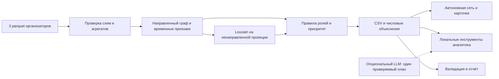

# DalaAI — Граф денег

**Кого проверить первым — и почему?** Приложение помогает AML-аналитику банка выбрать клиентов для проверки по наблюдаемым переводам. Карточка объясняет роль, приоритет, связи и следующий запрос данных.

**2 248 клиентов · 6 объяснимых ролей · топ-50 · локальный экран сети**

## Посмотреть готовое приложение

1. Скачайте репозиторий: **Code → Download ZIP**, затем распакуйте архив.
2. Откройте **`out/network.html`** двойным щелчком.
3. Нажмите **«Первый в очереди»** или вставьте полный gid в поиск, например `100000000331309100`.

**Для просмотра готового результата Python, сервер и интернет не нужны.** GitHub показывает исходный код HTML — открывайте скачанный файл. Карточку можно сохранить кнопкой «Скачать карточку»; верхние ссылки выгружают CSV.

Результаты — гипотезы для проверки, не утверждения о виновности. Приоритет и сила правила не являются вероятностью нарушения.

## Быстрый запуск

Чтобы **пересчитать результат из исходных данных**, откройте терминал в распакованной папке проекта, где лежат `run.py` и `requirements.txt`. Три parquet уже находятся в `data/`.

Нужен **Python 3.13**. Выберите инструкцию для своей ОС. Первичная установка пакетов требует интернета; повторный расчёт работает без сети, API-ключей и GPU. Активация окружения и создание `.env` не требуются.

<details>
<summary><strong>Windows / PowerShell — установить и запустить</strong></summary>

Если Python 3.13 уже установлен, скопируйте блок в PowerShell:

```powershell
py -3.13 -m venv .venv
if ($LASTEXITCODE -ne 0) { throw 'Не удалось создать окружение Python 3.13' }
.\.venv\Scripts\python.exe -m pip install -r requirements.txt
if ($LASTEXITCODE -ne 0) { throw 'Не удалось установить зависимости' }
.\.venv\Scripts\python.exe run.py --data data --out out
if ($LASTEXITCODE -ne 0) { throw 'Расчёт завершился ошибкой' }
Start-Process .\out\network.html
```

После успешного расчёта приложение откроется в браузере. Если `py -3.13` недоступен, используйте блок «Python 3.13 не установлен» ниже.

**Повторный расчёт — одна команда:**

```powershell
.\.venv\Scripts\python.exe run.py --data data --out out
```

Дождитесь `PASS`, затем откройте `out/network.html` или обновите уже открытую страницу.

</details>

<details>
<summary><strong>macOS / Linux — установить и запустить</strong></summary>

Если Python 3.13 уже установлен:

```bash
python3.13 -m venv .venv && .venv/bin/python -m pip install -r requirements.txt && .venv/bin/python run.py --data data --out out
```

После сообщения `PASS` откройте **`out/network.html`** в браузере.

**Повторный расчёт — одна команда:**

```bash
.venv/bin/python run.py --data data --out out
```

Команды проверены на macOS; полный Python-пайплайн на Linux пока не подтверждён.

</details>

<details>
<summary><strong>Python 3.13 не установлен — подготовка через uv</strong></summary>

Установите [uv по официальной инструкции](https://docs.astral.sh/uv/getting-started/installation/). Он самостоятельно скачает нужный Python. Выполняйте команды из папки проекта; подготовка требует интернета.

**Windows PowerShell:**

```powershell
uv venv --managed-python --python 3.13 .venv
if ($LASTEXITCODE -ne 0) { throw 'Не удалось подготовить Python 3.13' }
uv pip install --python .\.venv\Scripts\python.exe -r requirements.txt
if ($LASTEXITCODE -ne 0) { throw 'Не удалось установить зависимости' }
.\.venv\Scripts\python.exe run.py --data data --out out
if ($LASTEXITCODE -ne 0) { throw 'Расчёт завершился ошибкой' }
Start-Process .\out\network.html
```

**macOS / Linux:**

```bash
uv venv --managed-python --python 3.13 .venv && uv pip install --python .venv/bin/python -r requirements.txt && .venv/bin/python run.py --data data --out out
```

После `PASS` откройте `out/network.html`. В дальнейшем используйте команду повторного расчёта для своей ОС — uv и сеть уже не нужны.

Для машины без интернета заранее подготовьте Python 3.13 и совместимые пакеты: [инструкция offline-установки](docs/install.md#установка-без-интернета). Установщик и `wheelhouse/` не включены в репозиторий. Поддержка Python 3.12 не заявляется.

</details>

## Что получает аналитик

После расчёта все результаты находятся в **`out/`**:

| Файл | Что открыть или проверить |
|---|---|
| `network.html` | Приложение: сеть переводов и карточки клиентов |
| `nodes_roles.csv` | Роли, приоритеты и объяснения всех клиентов |
| `clusters.csv` | Сообщества и гипотезы по группам |
| `top_nodes.csv` | Очередь из 50 клиентов для проверки |
| `report.json` | Фактическое время расчёта и контрольные показатели |

Контрольная сборка DalaAI на macOS ARM64/Python 3.13.15: **4,79 с на расчёт**, без установки зависимостей; **98 тестов PASS**. [Протокол](docs/dalaai-release-verification.json). Среды и границы проверок раскрыты ниже.

**AI в продукте:** опциональный LLM выбирает разрешённый инструмент графа. Основной расчёт и экран работают без ключа; встроенный браузерный помощник использует правила.

[Короткий маршрут жюри](docs/judging-guide.md) · [Примеры разбора клиентов](docs/rehearsal.md) · [Подробная установка](docs/install.md)

## Подробности для проверки

Откройте нужный раздел. Формулы, ограничения и протоколы сохранены полностью.

<details>
<summary><strong>Возможности, пользовательский сценарий и полный состав результатов</strong></summary>

| Результат | Что это даёт аналитику |
|---|---|
| **2 248 узлов**, включая 19 изолятов | Ни один клиент из входной таблицы не потерян |
| **6 ролей с порогами и числовыми объяснениями** | Назначение роли можно проверить по метрикам любого gid |
| **Топ-50**, в первых 20 нет seed | Очередь смещает внимание на узлы за пределами исходного списка seed |
| **48 сообществ + группа изолятов** | Видны группы связей и гипотезы для дальнейшей проверки |
| **391 → 204 достижимых пар** после удаления топ-5 не-seed | Проверяемый сценарий изменения связности; не оценка предотвращённых нарушений |

Распределение ролей: **21 coordinator · 42 consolidator · 43 distributor · 36 transit · 566 terminal · 1 540 peripheral**. Роль, score и кластер — основания для проверки, не утверждение о виновности. Размеченной истины нет, поэтому accuracy и вероятности нарушения не заявляются.

## Что реализовано

| Обязательный пункт кейса | Реализация |
|---|---|
| Один запуск от parquet до результата менее чем за 5 минут | `run.py`: проверка входов, расчёт, выгрузки и встроенная валидация |
| Роль, score и evidence у каждого узла | Все 2 248 gid; шесть формальных ролей; evidence с числами до 200 символов |
| Объяснение произвольного gid | Карточка с порогами, метриками, одновременно сработавшими правилами и составом приоритета |
| Кластеры и гипотезы | Полное покрытие узлов; размеры, seed и внутренний оборот каждой группы |
| Не менее 20 приоритетов и экран сети | Топ-50, направления переводов, роли/кластеры, поиск, переходы по связям и TXT-карточка |

Дополнительно: временные признаки и достижимость по датам, направленные циклы, сценарии удаления топ-N, чувствительность кластеров/приоритетов, запросы недостающих данных и опциональный AI-планировщик. Возможности и их ограничения описаны ниже.

## Как работает решение

1. Запустите расчёт на исходных `nodes`, `edges` и `transactions` из `data/`.
2. Откройте `out/network.html`: сначала показан обзор всей сети без выбранного клиента. Нажмите «Первый в очереди», строку топ-листа либо найдите полный gid.
3. В карточке проверьте роль, её правило, входящие/исходящие связи, слагаемые приоритета и ограничения. Перейдите к контрагенту или сохраните карточку в TXT.
4. Используйте следующий запрос данных из карточки и `data_requests.csv` для углублённой проверки. Автоматическое обвинение, блокировка счетов или отправка запросов во внешние системы не выполняются.

### Все выходные файлы и обязательные схемы

| Файл | Содержание |
|---|---|
| `out/nodes_roles.csv` | Все 2 248 gid, роли, scores, cluster_id, числовые evidence и дополнительные объяснимые признаки |
| `out/clusters.csv` | Размер, seed, внутренний оборот, пять приоритетных gid и гипотеза каждого кластера |
| `out/top_nodes.csv` | 50 приоритетных узлов с обоснованием и следующим действием |
| `out/network.html` | Автономная сеть с направлением переводов, ролями/кластерами, поиском и карточками |
| `out/report.json` | Параметры и фактические результаты текущего прогона, время, контрольные показатели |
| `out/data_requests.csv` | Какие данные запросить для узлов с ограниченной видимостью |
| `out/resilience.csv` | Изменение наблюдаемой сети после удаления приоритетных узлов |
| `out/node_stability.csv` | Устойчивость сообщества и положения каждого gid в очереди проверки |
| `out/sensitivity.csv` | 5 запусков Louvain и 11 сценариев весов приоритета |

Фиксированные обязательные схемы сохраняются; дополнительные поля разрешены ТЗ:

```text
nodes_roles.csv: gid, role, role_score, cluster_id, priority_score, evidence
clusters.csv: cluster_id, n_nodes, n_seed, sum_kzt_internal, top_gids, hypothesis
top_nodes.csv: rank, gid, role, priority_score, why
```

`evidence` содержит числа и не превышает 200 символов. Gid хранятся как целые в Python/CSV и как **строки в интерфейсе**: 18-значные идентификаторы превышают точность JavaScript Number. При открытии CSV в Excel импортируйте gid как текст.

</details>

<details>
<summary><strong>Исходные данные и архитектура</strong></summary>

## Данные и интеграции

Источник — обезличенные данные организаторов HackAlem AI, только для хакатона; внешнего обогащения нет.

| Вход | Строк | Содержание |
|---|---:|---|
| `data/nodes.parquet` | 2 248 | gid, минимальная глубина обхода, is_seed |
| `data/edges.parquet` | 3 119 | Направленные пары, суммы и число переводов |
| `data/transactions.parquet` | 4 840 | Даты и суммы отдельных операций |

Наблюдаются внутрибанковские переводы за **1–31 июля 2026**, от **5 000 KZT**, четыре колена исходящего обхода от **81 seed**. Оборот — **365 890 012,01 KZT**. В полном графе 35 слабосвязных компонент: 16 с рёбрами и 19 изолятов. 444 узла на глубине 4 имеют нулевой наблюдаемый выход.

Загрузчик сверяет типы и схемы, уникальность gid/рёбер, концы рёбер, период, порог и агрегаты transactions ↔ edges. Допуск сумм — 0,01 KZT; ошибки останавливают расчёт. Распределения и обоснование порогов: [разведка данных](docs/analysis.md), [README датасета](data/README.md).

Обязательных внешних интеграций нет. OpenAI Responses API используется только по явному запросу в опциональном CLI; основной расчёт и браузер к нему не обращаются.

## Схема решения

[Схема на одном слайде](docs/architecture.svg).



| Компоненты | Ответственность |
|---|---|
| `aml/load.py`, `features.py`, `temporal_reach.py` | Загрузка, направленные/временные признаки и полнота наблюдения |
| `aml/roles.py`, `clusters.py`, `priority.py` | Пороговые роли, сообщества и прозрачная очередь |
| `aml/explain.py`, `resilience.py`, `sensitivity.py` | Обоснования, следующий запрос, удаление узлов и чувствительность |
| `aml/viewer.py`, `viewer_template.html` | Автономный Canvas-интерфейс с направлением связей |
| `aml/assistant.py`, `ai_assistant.py` | Локальные запросы; опциональный ограниченный LLM-планировщик |
| `run.py`, `validate.py`, `aml/validate*.py`, `tests/` | Сборка, контроль результата и регрессии |

</details>

<details>
<summary><strong>Методика: метрики, роли, формулы и кластеры</strong></summary>

## Метрики

- `in_deg/out_deg` — число разных плательщиков/получателей; `in_kzt/out_kzt` — суммы; `in_tx/out_tx` — число операций. Средний чек равен сумме, делённой на число операций.
- `pass_through=out_kzt/in_kzt` определён только при положительном входе; иначе технический 0 и `pass_through_defined=False`. Входящие seed неполны, поэтому их ratio не используется для назначения transit.
- `seed_reach` — число других seed с направленным путём до узла **без учёта дат**; `seed_payers` — прямые seed-плательщики. Достижимость не устанавливает источник денег.
- PageRank использует направления и суммы (`tol=1e-10`, `max_iter=1000`, стандартный damping). Betweenness — точная нормированная центральность на направленном **невзвешенном** графе; расстояние — число шагов.
- `fast_out_share` сопоставляет входящие суммы FIFO с ещё не использованными исходящими через **1–2 дня**. Исходящая сумма не расходуется повторно; операции того же дня исключены. `matched_lag_days` — средний лаг, взвешенный сопоставленной суммой, 0 при отсутствии сопоставления.
- `max_payers_same_day` — максимум разных плательщиков за день; `burst_share` — доля входа+выхода в самый активный день; `near_threshold_share` — доля операций в [5 000; 10 000) KZT. Это признаки, а не доказательство дробления.
- `in_cycle` — участие в направленной сильно связной компоненте с несколькими узлами или петле. `reciprocal_neighbors` — взаимные связи; `repeat_routes` — инцидентные рёбра с несколькими переводами, не многошаговые повторяющиеся маршруты. `volume_depth_percentile` сравнивает log-оборот с тем же коленом.

Временная достижимость рассчитывается отдельно: `temporal_seed_reach_strict_days` требует строго возрастающих дней, `temporal_seed_reach_upper` допускает возможный порядок в один день. Seed доступны с начала месяца, собственный seed исключён; всегда `strict_days ≤ upper ≤ seed_reach`. Суммы и происхождение средств эти пути не прослеживают. У лидера очереди структурно достижимы **7 seed**, по датам — **1**; приоритет остаётся структурным, различие показано в карточке.

## Роли и пороги

Порядок: **coordinator → consolidator → distributor → transit → terminal → peripheral**. Сначала определяются базовые роли, затем coordinator может заменить результат. Соседи-хабы для coordinator определяются непосредственно порогами, поэтому результат не зависит от очередности обхода узлов. Пороговые значения находятся в `aml/roles.py`.

`matched_roles` сохраняет все одновременно выполненные правила. Например, coordinator может показывать также консолидацию и веерное распределение. Основная `role` выбирается по приоритету правил; `top_nodes.why` дополнительно раскрывает оба направления потока, слагаемые приоритета и `next_request`.

| Роль | Формальное правило |
|---|---|
| `coordinator` | Есть вход и выход; ≥2 разных соседей с `in_deg≥5` или `out_deg≥10`; `seed_reach≥3`; betweenness ≥q99 по всем узлам и строго >0 |
| `consolidator` | `in_deg≥5`; сумма и seed-плательщики показаны в объяснении |
| `distributor` | `out_deg≥10` |
| `transit` | Не seed; есть вход и выход; `0,8≤pass_through≤1,2`; `in_kzt≥50 000` |
| `terminal` | `depth<4`, `in_kzt≥50 000` и либо `out_deg=0`, либо не-seed с `pass_through≤0,2` и `in_kzt≥200 000` |
| `peripheral` | Ни одно предыдущее правило не выполнено; недостаток признаков, а не низкий риск |

Обоснование: q95 входящей степени равен 3, исходящей — 5; пороги 5 и 10 выделяют наблюдаемую концентрацию выше основной массы. Медиана входа — 50 000 KZT; 200 000 выше q75≈164 528. Из 72 узлов с отношением 0,8–1,2 дополнительные условия отсеивают неполные/малые наблюдения. Порог q99 betweenness на предоставленном графе примерно **0,001989231914**, фактическое значение сохраняется при расчёте. Порог не выбирается под заранее заданные gid.

### Сила свидетельств role_score

Обозначим `clip(x)=min(1,max(0,x))`, `b99` — q99 betweenness, `f=fast_out_share`, `p=pass_through`:

| Роль | Формула |
|---|---|
| coordinator | `0,5 + 0,5×clip(betweenness/max(b99,1e-15) − 1)` |
| consolidator | `0,5 + 0,5×clip((in_deg−5)/10)` |
| distributor | `0,5 + 0,5×clip((out_deg−10)/30)` |
| transit | `0,5 + 0,25×max(0,1−abs(p−1)/0,2) + 0,25×f` |
| terminal | `0,5 + 0,5×clip((in_kzt/50 000−1)/9)` |
| peripheral | `0,25`, если узел обрезан или изолирован; иначе `0,5` |

Для consolidator на обрезанном четвёртом колене score дополнительно умножается на 0,8. Итог ограничивается [0,1] и округляется до 6 знаков. Высокий score означает силу заданного правила, не достоверность обвинения. Для peripheral фиксированный score отражает остаточное правило и неполноту наблюдения.

## Приоритет для аналитика

```text
raw = 0.30 × role_weight
    + 0.25 × log1p(seed_reach) / max(max(log1p(seed_reach)), 1)
    + 0.20 × log1p(in_kzt + out_kzt) / max(max(log1p(in_kzt + out_kzt)), 1)
    + 0.15 × percentile_rank(pagerank)
    + 0.10 × patterns
priority_score = clip(raw × (0.6 if is_seed else 1))
```

Веса ролей: coordinator=1; consolidator=0,9; distributor=0,8; transit=0,6; terminal=0,5; peripheral=0,1. `percentile_rank` — средний ранг связок, делённый на число узлов. `patterns` — среднее трёх индикаторов: `fast_out_share≥0,5`, `max_payers_same_day≥3`, `in_cycle=True`. Итог округляется до 8 знаков; при равенстве выше меньший gid.

Seed понижаются множителем 0,6, поскольку уже известны и кейс требует перенести внимание на другие узлы. Каждое слагаемое сохранено в CSV (`priority_role`, `priority_reach`, `priority_volume`, `priority_pagerank`, `priority_patterns`, `seed_discount`), поэтому позицию можно объяснить. Критичность после удаления узла не добавляется скрытым бонусом в score.

## Кластеры

Только кластеризация игнорирует направление. Встречные суммы A→B и B→A складываются; вес ненаправленной пары — `log1p(общая сумма)`. Louvain использует `seed=42`, `resolution=1`; узлы и рёбра заранее сортируются. Сообщества нумеруются по размеру, затем минимальному gid. Число групп не подгоняется под подсказку организаторов.

В текущем результате **48 сообществ**, из них 9 содержат несколько seed. Все 19 изолятов входят в техническую группу **0**, которая не объявляется сообществом. Внутренний оборот считается по исходным направленным суммам, без логарифма и удвоения. `top_gids` — пять приоритетных клиентов группы.

Гипотезы строятся по правилам: сбор от ≥3 seed; веерное распределение; ≥2 транзитных узла; иначе наблюдаемая связанная активность. Разведка запускает Louvain вместе с изолятами, а основной расчёт отдельно; это меняет случайный обход. Для проверки продукта используйте `out/clusters.csv` и `out/report.json`.

</details>

<details>
<summary><strong>Помощник, AI и чувствительность результата</strong></summary>

## Интерфейс и помощник

Карта показывает стрелки переводов, роли или кластеры, очередь, фильтры и окружение выбранного узла на один/два шага. Карточка и TXT сохраняют правила, метрики, состав приоритета, временную достижимость, чувствительность и следующий запрос. Gid остаются строками целиком. Изоляты доступны в поиске; их устойчивость сообщества помечена «Не оценивалась».

| Режим | Что действительно делает |
|---|---|
| Помощник в HTML | Без LLM: полные команды `топ`, `кластеры`, `ограничения`, gid или `Объясни <gid>`; до 3 разных gid. Неподдержанный вопрос/неизвестный gid даёт пояснение, не выдуманный ответ |
| Локальный CLI | Карточка, кратчайший направленный путь, общие прямые получатели, сводка кластера по поддерживаемым формулировкам |
| Опциональный AI CLI | LLM выбирает **один** из инструментов `get_node`, `paths`, `common_receivers`, `cluster_summary`; аргументы валидируются, инструмент и шаблон фактического ответа выполняются локально |

Пример без ключа:

```bash
.venv/bin/python -m aml.assistant --out out --data data --question 'Объясни 100000000331309100'
```

Онлайн-планирование включается только с `--online`, `OPENAI_API_KEY` и `OPENAI_MODEL`. Проверенная модель — `gpt-5.4-nano-2026-03-17`. В API передаётся вопрос с псевдонимами вместо gid, схема инструментов и допустимые псевдонимы; граф, метрики и результаты инструментов остаются локальными. Остальной текст вопроса не обезличивается автоматически.

Ограничения вызовов: один запрос, максимум 1 024 выходных токена, 20 попыток по умолчанию в постоянном локальном журнале, без повторов. При отсутствии настроек или ошибке — явно обозначенный локальный режим. Браузер не хранит ключи. Полный запуск: [AI-помощник](docs/ai-assistant.md).

**Проверка AI:** 20 тестов с подменой HTTP; живая оценка — **12/12 подготовленных случаев** (11 онлайн и один локальный отказ). Это малый набор разработки, не accuracy ролей и не гарантия понимания любого вопроса. [Результаты](docs/ai-eval-results.json), [расход и ограничения бюджета](docs/budget.md).

## Чувствительность и изменение сети

- **Кластеры:** пять seed Louvain 42–46 на неизменной проекции дают 43–49 сообществ без изолятов. ARI альтернатив к исходному разбиению — 0,671–0,690; средний Jaccard состава — 0,658. Это показывает неопределённость границ, а не истинный состав группы.
- **Приоритет:** исходные веса и 10 вариантов изменения одного веса на ±20% с нормировкой. В альтернативных топах остаются 18–20 из исходных 20 клиентов; 18 входят во все 11 сценариев. Пороги ролей, данные и скидка seed не варьируются.
- **Удаление топ-N:** сценарии 0/5/10/20 приоритетных не-seed. Цели — базовые consolidator, включая переопределённых coordinator. При удалении топ-5 остаётся 204 из 391 достижимой пары seed→цель; 148 пар теряются к сохранившимся целям. Удаление самих получателей учитывается отдельно.
- **Полнота:** `data_requests.csv` предлагает запросить следующее колено, внешние входящие/остаток, наличные, межбанковские и подпороговые операции в зависимости от ограничений узла.

Методика и границы: [sensitivity-method.md](docs/sensitivity-method.md). Устойчивость не равна точности, а сценарий удаления не измеряет предотвращённый ущерб.

</details>

<details>
<summary><strong>Как проверить расчёт: команды, примеры и протоколы</strong></summary>

## Как проверять

После команды запуска:

```bash
.venv/bin/python validate.py --data data --out out
.venv/bin/python -m unittest discover -s tests
.venv/bin/python scripts/audit_top.py --data data --out out
```

На Windows замените исполняемый файл на `.\.venv\Scripts\python.exe`. Для программной проверки взаимодействий интерфейса дополнительно нужен Node.js: `node scripts/check_viewer.cjs out/network.html`. Node не нужен для расчёта или открытия HTML.

**Воспроизводимый сценарий жюри:**

1. Запустить расчёт из исходных parquet в новую выходную папку, без готовых результатов. Проверить время <300 с и встроенный PASS.
2. Проверить 2 248 уникальных gid, шесть допустимых ролей, непустые evidence с числами ≤200 символов, scores в [0,1], согласованные кластеры и отсортированный топ ≥20.
3. Открыть экран, найти любые три gid, объяснить правило по метрикам и перейти по входящим/исходящим связям. Примеры ниже помогают проверить разные ограничения.
4. Проверить отсутствие terminal у depth=4 и наличие 19 изолятов; повторить расчёт и сравнить CSV. Время в report.json может отличаться.

| Пример | gid | Что проверить |
|---|---|---|
| Лидер очереди | `100000000331309100` | 5 плательщиков, 99 получателей, 11 структурных соседей; coordinator по q99. 7 seed без дат и 1 по датам — разные показатели |
| Транзит | `100000000201868100` | Не seed; вход/выход по 190 000 KZT, ratio=1,0; временное сопоставление не доказывает те же деньги |
| Граница выгрузки | `100000002622822100` | Depth=4, вход 750 000 KZT, выхода нет; peripheral, а не terminal |

Эти примеры взяты из результата и не встроены в алгоритм. Независимый `audit_top.py` читает parquet без импорта расчётных модулей; сверяет суммы, степени, достижимость, временное сопоставление через max-flow и сценарии удаления. [Разбор всех ролей](docs/rehearsal.md), [демо на 5 минут](docs/demo.md).

### Фактические проверки

Текущая сборка DalaAI: **98 тестов PASS**, расчёт из новой исходной папки без out — **4,79 с** по внешнему таймеру; валидатор, аудит и DOM-регрессии прошли, 7 CSV и HTML совпали с рабочей сборкой на macOS ARM64/Python 3.13.15. Использовано ранее отдельно подготовленное Python-окружение с закреплёнными зависимостями; время установки пакетов не входит в измерение. Все семь CSV также совпали с версией до переименования. [Протокол DalaAI](docs/dalaai-release-verification.json).

Windows 11/Python 3.13.15: отдельно проверена чистая установка из локальных wheels, затем `c31e093` — 90 тестов / 95 с QA-обёрткой, девять подмен валидатора отклонены, UTF-8 проверен в cp1251. Отдельная загрузка Python через uv также прошла. Между Windows-прогонами результаты побайтно одинаковы; с Git сравниваются после нормализации LF/CRLF. Это не проверка последующих UI-изменений. [Протокол Windows](docs/handoffs/qa-erzhan-20260923.md).

Linux-установка и нагрузка на миллионе узлов не проверены. DOM-тесты не заменяют визуальный просмотр в браузере; Python socket-guard не является системным firewall. Исторические измерения и внешние отзывы с границами — в [docs/verification.md](docs/verification.md). Репетиция «три gid за минуту» требует человека и не выдаётся за выполненный автоматический тест.

</details>

<details>
<summary><strong>Ограничения данных и план масштабирования</strong></summary>

## Ловушки и ограничения

| Ограничение | Как учитываем |
|---|---|
| 444 узла четвёртого колена без выхода | Флаг обрыва, запрет terminal, осторожное evidence, запрос следующего колена |
| Входящие seed неполны | Нет транзитной роли на основе ratio; предупреждение о неполной наблюдаемости |
| Выход больше входа | `unobserved_funding` при выходе >1,2 входа и положительном выходе: возможны невидимые поступления **или начальный остаток**, а не доказанный внешний доход |
| 19 seed без рёбер | Узлы загружаются прежде рёбер и сохраняются; технический cluster 0 |
| Только внутрибанк и порог ≥5 000 | Terminal — получатель в видимой выборке; запрашиваем наличные, межбанк и малые переводы |
| Даты без времени суток | В FIFO исключено совпадение дня; связь тех же денег не доказана |
| Нет клиентских атрибутов и ground truth | Только структура/суммы/даты; никаких ФИО, доходов, обученной accuracy или обвинений |
| Ограниченный месяц наблюдения | Совпадение потоков и связи не означают общность экономической цели |

Устойчивость — структурный сценарий удаления узлов, а не прогноз предотвращённого ущерба. Полноценные повторяющиеся многошаговые маршруты, HITS, обученная модель и подтверждённая работа на миллионе узлов не заявлены. Опциональный внешний планировщик проверен на ограниченном наборе вопросов; ошибка выбора инструмента на иной формулировке возможна. Роль coordinator показывает структурную связность и не устанавливает организатора группы.

## Рост до 1 млн узлов

Это план развития, не результат нагрузочного теста. Первым узким местом станет точная betweenness и Python-объекты NetworkX: заменить их приближённой betweenness по выборке источников и компактным графовым движком (например, igraph). Агрегации транзакций перенести в колоночную обработку/SQL, хранить рёбра партициями; признаки считать инкрементально по новым датам.

Достижимость от небольшого набора seed можно хранить битовыми масками и распространять по DAG сильно связных компонент. Сообщества пересчитывать по затронутым областям или применять Leiden с проверкой сопоставимости. В интерфейс отдавать подграф выбранного узла/кластера и агрегированные связи, а не миллион узлов сразу. Точные текущие правила и семантика направлений сохраняются; приближения и новые пороги требуют отдельной оценки стабильности и времени.

</details>

<details>
<summary><strong>Технологии, лицензии, вклад команды и локальная версия</strong></summary>

## Источники, технологии и вклад

- Языки: Python 3.13 для расчёта и CLI; JavaScript, HTML и CSS для автономного интерфейса. Граф рисуется встроенным Canvas-кодом, без внешних CDN и обязательного веб-сервера. Опциональный планировщик обращается к OpenAI Responses API; проверенная модель — `gpt-5.4-nano-2026-03-17`. Других внешних источников данных и обязательных API нет.
- Датасет и `starter/` — материалы организаторов HackAlem AI. Стартовый код оставлен отдельно; он использован как справка по загрузке, базовым метрикам и контракту CSV. Он не выполняет классификацию вместо решения команды.
- Код и документация разработаны с помощью **Codex**. AI-агент используется при разработке; аналитические роли продукта рассчитываются прозрачными правилами. Применение AI не выдаётся за качество обученной модели.
- Python: pandas 3.0.6, PyArrow 25.0.1, NetworkX 3.7, NumPy 2.5.3, SciPy 1.18.1; вспомогательные зависимости python-dateutil 2.9.0.post0 и six 1.17.0. Точные версии — в `requirements.txt`.
- Первичные проекты: [pandas](https://github.com/pandas-dev/pandas), [Apache Arrow](https://github.com/apache/arrow), [NetworkX](https://github.com/networkx/networkx), [NumPy](https://github.com/numpy/numpy), [SciPy](https://github.com/scipy/scipy), [dateutil](https://github.com/dateutil/dateutil), [six](https://github.com/benjaminp/six). Основные лицензии соответственно BSD-3-Clause, Apache-2.0, BSD-3-Clause, BSD-3-Clause, BSD-3-Clause, Apache-2.0/BSD-3-Clause и MIT; бинарные сборки могут содержать компоненты с дополнительными лицензиями, перечисленными в их metadata/LICENSE.

| Участник | Подтверждённая область вклада |
|---|---|
| a4ns | Основной пайплайн, методика, независимые аудиты, AI-планировщик, интеграция и README |
| Alexandr | Экран сети, карточки, навигация, экспорт и UI-проверки |
| Erzhan | Локальный помощник, независимые проверки Windows, подмены валидатора и подготовка демо |

История Git сохраняет настоящее авторство и время. Общая память команды: [TEAM_CONTEXT.md](TEAM_CONTEXT.md), [TASKS.md](TASKS.md), [правила совместной работы](docs/team-workflow.md). Фактические протоколы проверок отделены от планов и человеческой репетиции.

## Развёрнутая версия

Публичная deployed-версия не размещена. DalaAI запускается локально: откройте `out/network.html` после расчёта или скачайте сохранённый HTML из репозитория. GitHub показывает исходный текст HTML, а не работающий экран. Сервер и публикация сайта не требуются.

</details>

<details>
<summary><strong>Соответствие требованиям конкурса</strong></summary>

## Соответствие критериям конкурса

Веса ниже — шкала ТЗ, не самооценка заработанных баллов.

| Критерий | Материалы для проверки |
|---|---|
| Соответствие задаче и работоспособность — 25 | Пять обязательных функций, полный запуск, три CSV фиксированной схемы, поиск произвольного gid |
| Техническая реализация, включая AI — 25 | Направленные метрики, даты, прозрачные роли/приоритет, кластеры; ограниченный LLM-планировщик с проверкой аргументов |
| README и воспроизводимость — 25 | Закреплённые зависимости, Windows/uv/offline-инструкции, валидатор, тесты, независимый аудит и протоколы |
| Ценность — 15 | Очередь проверки, числовые основания, конкурирующие признаки и конкретный следующий запрос данных |
| Потенциал и оригинальность — 10 | Учёт границы наблюдения, чувствительность, различие структуры и дат, сценарии удаления и план масштабирования |

## Пункты промпта организаторов

| Пункт инструкции | Где раскрыт |
|---|---|
| 1–2. Название, проблема и пользователь | Заголовок и вступление |
| 3. Реализованные функции | [Что реализовано](#что-реализовано) |
| 4. Пользовательский сценарий | [Как работает решение](#как-работает-решение) |
| 5–6. Технологии и архитектура | [Схема](#схема-решения), [AI](#интерфейс-и-помощник), [источники и технологии](#источники-технологии-и-вклад) |
| 7. Установка и запуск | [Быстрый запуск](#быстрый-запуск), [подробная подготовка](docs/install.md) |
| 8. Сценарий проверки | [Как проверять](#как-проверять) |
| 9. Данные и интеграции | [Источники данных](#данные-и-интеграции) |
| 10. Ограничения | [Ловушки](#ловушки-и-ограничения), [масштабирование](#рост-до-1-млн-узлов) |
| 11. Deployed-версия | [Локальная версия](#развёрнутая-версия) |

Подача через платформу выполняется отдельно от push: [текст и порядок сдачи](docs/submission.md), [условия Положения и ТЗ](docs/compliance.md).

</details>
