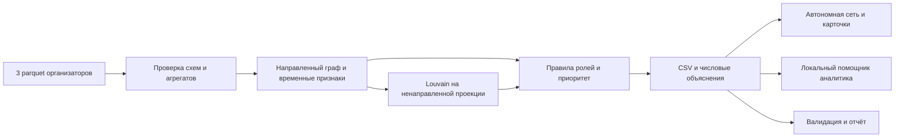

# Zherimai — Граф денег

Проект команды DalaAI для кейса HackAlem AI «Граф денег». Инструмент помогает AML-аналитику выбрать, кого из 2 248 клиентов проверить первым: рассчитывает роли по открытым правилам, выделяет кластеры, формирует приоритеты с числовыми объяснениями и показывает направленную сеть.

Результат на выданных данных:

- **2 248 клиентов:** 21 coordinator, 42 consolidator, 43 distributor, 36 transit, 566 terminal и 1 540 peripheral; все роли объясняются числами и порогами.
- **Топ-50 для проверки**, в первых 20 нет seed; каждому узлу доступны связи, ограничения выборки и следующий запрос данных.
- При удалении топ-5 приоритетных не-seed число достижимых пар seed→сборщик меняется **с 391 до 204**. Это сценарий изменения структуры сети, а не оценка предотвращённых нарушений.

**ИИ в продукте:** опциональный LLM выбирает один инструмент графа; gid заменяются псевдонимами, расчёты и граф остаются локальными. Без ключа работает явно обозначенный помощник по правилам.

Выводы — **гипотезы для углублённой проверки**, не установление виновности. Данных с размеченными ролями нет; `role_score` отражает силу правила, а не измеренную вероятность или accuracy.

Для проверки результата: [короткий маршрут эксперта](docs/judging-guide.md) — запуск, артефакты и разбор трёх gid.

Новому участнику и его Codex: [TEAM_CONTEXT.md](TEAM_CONTEXT.md), затем [правила совместной работы](docs/team-workflow.md).

План дальнейшей работы: [PLAN.md](PLAN.md). Текущий статус: [TASKS.md](TASKS.md).

## Быстрый запуск

Требуются **Python 3.13**, обычный ноутбук и три предоставленных parquet в `data/`. Версии зависимостей закреплены в `requirements.txt`. GPU, сервер, API-ключи и переменные окружения не нужны. `.env.example` документирует отсутствие обязательных настроек.

### Если Python 3.13 ещё не установлен

Установите **uv** по [официальной инструкции Astral](https://docs.astral.sh/uv/getting-started/installation/) — самостоятельный установщик не требует предварительной установки Python. Ниже проверен uv **0.12.18**. В свежем клоне из корня репозитория, macOS/Linux:

```bash
uv venv --managed-python --python 3.13 .venv && uv pip install --python .venv/bin/python -r requirements.txt && .venv/bin/python run.py --data data --out out
```

`--managed-python` выбирает Python, установленный uv; при его отсутствии uv скачивает подходящий 3.13 независимо от версии системного Python. [Описание управления Python](https://docs.astral.sh/uv/guides/install-python/).

Windows PowerShell, после установки uv:

```powershell
uv venv --managed-python --python 3.13 .venv
if ($LASTEXITCODE -ne 0) { throw 'Не удалось подготовить Python 3.13' }
uv pip install --python .\.venv\Scripts\python.exe -r requirements.txt
if ($LASTEXITCODE -ne 0) { throw 'Не удалось установить зависимости' }
.\.venv\Scripts\python.exe run.py --data data --out out
```

**Этап подготовки требует интернета** для загрузки uv, Python и пакетов. Затем запускайте `.venv/bin/python run.py` напрямую — uv и сеть для пересчёта не нужны. Это не установка из пустой машины без сети; для полностью автономной машины Python и совместимые пакеты готовятся заранее по разделу ниже.

Проверено на macOS ARM64 из копии без Python-окружения и out: скачан CPython **3.13.15**, установлены все закреплённые пакеты, холодный расчёт **15,009 с**, 90 тестов и аудит PASS; 7 CSV и HTML совпали побайтно. Установка Windows/Linux этим прогоном не подтверждается. [Протокол uv](docs/uv-verification.md).

### Если Python 3.13 уже установлен

Из корня репозитория, macOS/Linux, первая установка и полный пересчёт одной строкой:

```bash
python3.13 -m venv .venv && .venv/bin/python -m pip install -r requirements.txt && .venv/bin/python run.py --data data --out out
```

Первоначальная установка зависимостей требует доступа к источнику пакетов. После установки полный пересчёт работает без интернета:

```bash
.venv/bin/python run.py --data data --out out
```

Откройте `out/network.html` в браузере двойным щелчком. Страница содержит данные и код интерфейса локально. Полный пересчёт включает CSV, дополнительные отчёты и страницу сети. Фактическое время текущего запуска сохраняется в `out/report.json`; установка зависимостей в это время не входит.

Windows PowerShell, Python 3.13:

```powershell
py -3.13 -m venv .venv
.\.venv\Scripts\python.exe -m pip install -r requirements.txt
.\.venv\Scripts\python.exe run.py --data data --out out
Start-Process .\out\network.html
```

Для Python другой версии используйте путь uv выше либо отдельно установите 3.13. Проверьте `python3.13 --version` / `py -3.13 --version`. Совместимость пакетов с Python 3.12 не является проверкой приложения: поддержка 3.12 не заявляется. Версии пакетов не изменяйте.

### Установка без интернета

На машине с интернетом с **той же ОС, архитектурой и версией Python**, что у проверяющего, подготовьте пакеты:

```bash
python3.13 -m pip download --only-binary=:all: -r requirements.txt --dest wheelhouse
```

Перенесите репозиторий вместе с `wheelhouse/` на проверяющую машину и выполните:

```bash
python3.13 -m venv .venv
.venv/bin/python -m pip install --no-index --find-links wheelhouse -r requirements.txt
.venv/bin/python run.py --data data --out out
```

На Windows замените пути Python на `.\.venv\Scripts\python.exe`. Если wheel для целевой платформы отсутствует, подготовка завершится ошибкой; нельзя подменять её обещанием работы в произвольной среде. `wheelhouse` не включён в репозиторий. Отдельная чистая машина без заранее установленных зависимостей и без подготовленных wheels не сможет установить проект офлайн.

## Что получает аналитик

| Файл | Содержание |
|---|---|
| `out/nodes_roles.csv` | Все 2 248 gid, роли, scores, cluster_id, числовые evidence и дополнительные объяснимые признаки |
| `out/clusters.csv` | Размер, seed, внутренний оборот, пять приоритетных gid и гипотеза каждого кластера |
| `out/top_nodes.csv` | 50 приоритетных узлов с обоснованием и следующим действием |
| `out/network.html` | Автономная сеть с направлением переводов, ролями/кластерами, поиском и карточками |
| `out/report.json` | Параметры и фактические результаты текущего прогона, время, контрольные показатели |
| `out/data_requests.csv` | Какие данные запросить для узлов с ограниченной видимостью |
| `out/resilience.csv` | Изменение наблюдаемой сети после удаления приоритетных узлов |
| `out/node_stability.csv` | Устойчивость сообщества и положения каждого gid в очереди проверки |
| `out/sensitivity.csv` | 5 запусков Louvain и 11 сценариев весов приоритета |

Фиксированные обязательные схемы сохраняются; дополнительные поля разрешены ТЗ:

```text
nodes_roles.csv: gid, role, role_score, cluster_id, priority_score, evidence
clusters.csv: cluster_id, n_nodes, n_seed, sum_kzt_internal, top_gids, hypothesis
top_nodes.csv: rank, gid, role, priority_score, why
```

`evidence` содержит числа и не превышает 200 символов. Gid хранятся как целые в Python/CSV и как **строки в интерфейсе**: 18-значные идентификаторы превышают точность JavaScript Number. При открытии CSV в Excel импортируйте gid как текст.

Текущая версия на macOS ARM64 / Python 3.13.2: **4,20 с** в рабочем окружении и **4,91 с** по внешнему таймеру в новой папке без сохранённого out. Все **7 CSV и HTML совпали побайтно**; 90 тестов, независимый аудит и DOM-проверки прошли. Использовано ранее созданное чистое окружение с закреплёнными пакетами; их offline установка из локальных wheels заняла отдельно 14,68 с. Это измерения конкретных прогонов, не гарантия для любого оборудования. Все девять отрицательных сценариев QA отклоняются. Протокол и границы проверки: [docs/verification-integration.md](docs/verification-integration.md).

В результате 49 групп: 48 сообществ и группа изолятов 0; 9 сообществ содержат несколько seed. Роли: coordinator — 21, consolidator — 42, distributor — 43, transit — 36, terminal — 566, peripheral — 1 540. Свежий запуск обновляет измерение в `out/report.json`. Исторические измерения сохранены в [docs/verification.md](docs/verification.md).

Последнее объединение с QA-обёрткой Ержана: **95 тестов PASS**, расчёт из новой папки без out — **4,145 с** по внешнему таймеру; валидатор, независимый аудит и DOM-проверки прошли. Семь CSV и HTML совпали побайтно. [Актуальный протокол](docs/pre-submit-verification.json).

Ержан независимо проверил **чистую установку Windows 11 AMD64 / Python 3.13.15** для `ca8b43d`: восемь локальных wheels, без pip-индекса и кэша, установка 39,942 с; первый расчёт 5,1141 с, повторный 3,2561 с по внешнему таймеру. 77 тестов вместе с пятью проверками QA-обёртки и независимый аудит прошли; 7 CSV и HTML повторились побайтно. Python socket-аудит не обнаружил обращений в проверяемых процессах; это не системный firewall. Пакет Windows хранится у Ержана отдельно и не включён в Git; его исходники соответствуют проверенному `ca8b43d`, поэтому после обновления main требуется повторная приёмка. [Отчёт чистой установки](docs/handoffs/offline-windows-erzhan.md).

Александр сообщил о проверке UI `3ff778d`; эта версия уже объединена. По переданному капитаном отзыву Claude предыдущий экран также открыт в Chromium/Linux без ошибок и внешних запросов, но SHA той проверки неизвестен. Текущий экран проверен программно с DOM-заглушкой; его визуальный просмотр и полный Python-пайплайн на Linux пока не подтверждены. [Границы внешнего отзыва](docs/handoffs/external-review-followup.md).

## Данные и разведка

Источник — три обезличенных файла организаторов: `data/nodes.parquet`, `data/edges.parquet`, `data/transactions.parquet`. Только внутрибанковские переводы за 1–31 июля 2026 года, сумма от 5 000 KZT, исходящий обход от 81 seed на четыре колена. Данные предоставлены исключительно для хакатона; внешнего обогащения нет.

| Показатель | По фактическим данным |
|---|---:|
| Узлы / направленные рёбра / транзакции | 2 248 / 3 119 / 4 840 |
| Общий оборот | 365 890 012,01 KZT |
| Узлы по depth 0 / 1 / 2 / 3 / 4 | 81 / 472 / 462 / 789 / 444 |
| Нулевой выход по depth 0 / 1 / 2 / 3 / 4 | 31 / 305 / 269 / 505 / 444 |
| Полные слабосвязные компоненты | 35, включая 19 изолятов |
| Компоненты с рёбрами | 16 |
| Крупнейшая компонента | 1 877 узлов, 46 seed |

Загрузчик проверяет схемы, уникальность gid/рёбер, типы, известность концов рёбер, период, порог сумм и совпадение всех пар, сумм и количества операций между edges и transactions. Допуск агрегированных сумм — 0,01 KZT. Ошибочные данные останавливают расчёт.

Полные распределения, топ-20 входящих/исходящих степеней и сравнение Louvain: [docs/analysis.md](docs/analysis.md). Повторная разведка: `.venv/bin/python scripts/analyze.py`. Подсказка ТЗ о 16 компонентах относится к узлам с рёбрами; все обязательные изоляты также сохранены.

## Схема решения

Готовая схема на один слайд: [docs/architecture.svg](docs/architecture.svg).



| Модуль | Ответственность |
|---|---|
| `aml/load.py` | Загрузка, инварианты данных, полный DiGraph |
| `aml/features.py` | Структурные и временные метрики |
| `aml/temporal_reach.py` | Достижимость от seed с учётом дат и неизвестного порядка внутри дня |
| `aml/roles.py` | Пороговые правила, сила роли и flags |
| `aml/clusters.py` | Проекция, Louvain, сводка сообществ |
| `aml/priority.py` | Прозрачная формула ранжирования |
| `aml/explain.py` | Evidence, why, запросы недостающих данных |
| `aml/viewer.py` | Автономный экран и карточки |
| `aml/assistant.py` | Локальные запросы к графу |
| `aml/ai_assistant.py` | Опциональный ограниченный API-планировщик с локальным исполнением |
| `aml/resilience.py` | Структурный сценарий удаления топ-5/10/20 не-seed |
| `aml/sensitivity.py` | Чувствительность сообществ и очереди проверки |
| `run.py`, `validate.py` | Полный запуск и проверка артефактов |

## Метрики

`in_deg/out_deg` — разные плательщики/получатели; `in_kzt/out_kzt` — наблюдаемые суммы; `in_tx/out_tx` — число операций. Средний чек равен сумме, делённой на число операций. Суммы и количество контрагентов не смешиваются.

`pass_through = out_kzt / in_kzt` только при положительном входе. При нулевом входе техническое значение 0 сопровождается `pass_through_defined=False`. `balance_comparable=False` также у seed: их входящие занижены способом сбора. Даже сравнимое отношение описывает лишь выгрузку, а не полный баланс.

`seed_reach` — количество других seed, имеющих направленный путь к узлу, без пути нулевой длины к себе. Это **структурная достижимость без учёта дат**, а не число источников денег. `seed_payers` — число прямых seed-плательщиков. PageRank учитывает направление и суммы (`tol=1e-10`, `max_iter=1000`, стандартный damping NetworkX). Betweenness рассчитывается **точно на направленном невзвешенном графе**, нормирована; расстояние — число шагов, сумма не трактуется как длина пути.

`temporal_seed_reach_strict_days` допускает только пути со строго возрастающими днями. `temporal_seed_reach_upper` допускает возможный порядок переводов одного дня, распространяет достижимость внутри дня до замыкания и даёт оптимистическую верхнюю границу по датам. Seed считаются доступными с начала месяца; собственный seed исключён. Всегда `strict_days ≤ upper ≤ seed_reach`. Эти признаки не учитывают сумму и не прослеживают происхождение средств. В текущем графе у **1 827 узлов** верхняя временная граница ниже структурной достижимости; у лидера очереди это **1 против 7**. Правила/приоритет остаются структурными, ограничение показано отдельно в `top_nodes.why` и CSV.

Временные признаки рассчитываются по transactions:

- `fast_out_share`: входящие суммы сопоставляются FIFO с ещё не использованными исходящими через **1 или 2 дня**. Каждая исходящая сумма используется не более одного раза. Переводы того же дня исключены из сопоставления, поскольку порядок неизвестен.
- `matched_lag_days`: средний лаг сопоставленного объёма, взвешенный суммой; 0 при отсутствии сопоставления. Это не медиана и не срок хранения денег клиента.
- `max_payers_same_day`: максимальное число разных входящих плательщиков за один день; `burst_share` — доля оборота входа+выхода, пришедшаяся на самый активный день.
- `near_threshold_share`: доля входящих/исходящих операций в диапазоне [5 000; 10 000) KZT. Она не доказывает дробление и не видит операции ниже порога.

`in_cycle` означает принадлежность направленной сильно связной компоненте с несколькими узлами либо петле. `reciprocal_neighbors` считает взаимные связи, `repeat_routes` — инцидентные рёбра с несколькими переводами, а не доказанные повторяющиеся многошаговые маршруты. `volume_depth_percentile` сравнивает log-оборот с узлами того же колена.

## Роли и пороги

Порядок: **coordinator → consolidator → distributor → transit → terminal → peripheral**. Сначала определяются базовые роли, затем coordinator может заменить результат. Соседи-хабы для coordinator определяются непосредственно порогами, поэтому результат не зависит от очередности обхода узлов. Пороговые значения находятся в `aml/roles.py`.

`matched_roles` сохраняет все одновременно выполненные правила. Например, coordinator может показывать также консолидацию и веерное распределение. Основная `role` выбирается по приоритету правил; `top_nodes.why` дополнительно раскрывает оба направления потока, слагаемые приоритета и `next_request`.

| Роль | Формальное правило |
|---|---|
| `coordinator` | Есть вход и выход; ≥2 разных соседей с `in_deg≥5` или `out_deg≥10`; `seed_reach≥3`; betweenness ≥q99 по всем узлам и строго >0 |
| `consolidator` | `in_deg≥5`; сумма и seed-плательщики показаны в объяснении |
| `distributor` | `out_deg≥10` |
| `transit` | Не seed; есть вход и выход; `0,8≤pass_through≤1,2`; `in_kzt≥50 000` |
| `terminal` | `depth<4`, `in_kzt≥50 000` и либо `out_deg=0`, либо не-seed с `pass_through≤0,2` и `in_kzt≥200 000` |
| `peripheral` | Ни одно предыдущее правило не выполнено; недостаток признаков, а не низкий риск |

Обоснование: q95 входящей степени равен 3, исходящей — 5; пороги 5 и 10 выделяют наблюдаемую концентрацию выше основной массы. Медиана входа — 50 000 KZT; 200 000 выше q75≈164 528. Из 72 узлов с отношением 0,8–1,2 дополнительные условия отсеивают неполные/малые наблюдения. Порог q99 betweenness на предоставленном графе примерно **0,001989231914**, фактическое значение сохраняется при расчёте. Порог не выбирается под заранее заданные gid.

### Сила свидетельств role_score

Обозначим `clip(x)=min(1,max(0,x))`, `b99` — q99 betweenness, `f=fast_out_share`, `p=pass_through`:

| Роль | Формула |
|---|---|
| coordinator | `0,5 + 0,5×clip(betweenness/max(b99,1e-15) − 1)` |
| consolidator | `0,5 + 0,5×clip((in_deg−5)/10)` |
| distributor | `0,5 + 0,5×clip((out_deg−10)/30)` |
| transit | `0,5 + 0,25×max(0,1−abs(p−1)/0,2) + 0,25×f` |
| terminal | `0,5 + 0,5×clip((in_kzt/50 000−1)/9)` |
| peripheral | `0,25`, если узел обрезан или изолирован; иначе `0,5` |

Для consolidator на обрезанном четвёртом колене score дополнительно умножается на 0,8. Итог ограничивается [0,1] и округляется до 6 знаков. Высокий score означает силу заданного правила, не достоверность обвинения. Для peripheral фиксированный score отражает остаточное правило и неполноту наблюдения.

## Приоритет для аналитика

```text
raw = 0.30 × role_weight
    + 0.25 × log1p(seed_reach) / max(max(log1p(seed_reach)), 1)
    + 0.20 × log1p(in_kzt + out_kzt) / max(max(log1p(in_kzt + out_kzt)), 1)
    + 0.15 × percentile_rank(pagerank)
    + 0.10 × patterns
priority_score = clip(raw × (0.6 if is_seed else 1))
```

Веса ролей: coordinator=1; consolidator=0,9; distributor=0,8; transit=0,6; terminal=0,5; peripheral=0,1. `percentile_rank` — средний ранг связок, делённый на число узлов. `patterns` — среднее трёх индикаторов: `fast_out_share≥0,5`, `max_payers_same_day≥3`, `in_cycle=True`. Итог округляется до 8 знаков; при равенстве выше меньший gid.

Seed понижаются множителем 0,6, поскольку уже известны и кейс требует перенести внимание на другие узлы. Каждое слагаемое сохранено в CSV (`priority_role`, `priority_reach`, `priority_volume`, `priority_pagerank`, `priority_patterns`, `seed_discount`), поэтому позицию можно объяснить. Критичность после удаления узла не добавляется скрытым бонусом в score.

## Кластеры

Только кластеризация игнорирует направление. Встречные суммы A→B и B→A сначала складываются; вес ненаправленной пары — `log1p(общая сумма)`. Это снижает доминирование крупнейших сумм. Louvain: `seed=42`, `resolution=1`. Узлы и рёбра предварительно сортируются. Сообщества сортируются по размеру, затем по минимальному gid, и получают стабильные номера.

Изолированные узлы объединены в техническую группу **0** «нет переводов в выгрузке»: она не объявляется сообществом. Внутренний оборот считается по исходным направленным суммам, без логарифма и без удвоения. `top_gids` содержит пять приоритетных узлов кластера. Гипотеза выбирается по базовым признакам: сбор от ≥3 seed; веерное распределение; ≥2 транзитных узла; иначе наблюдаемая связанная активность.

Число кластеров не подгоняется под 8 из примечания ТЗ. На сыром весе 8 означает сообщества с несколькими seed, а не все сообщества. Чувствительность проверена пятью запусками с seed 42–46; ARI и сходство состава сообществ приведены в разделе «Чувствительность результатов». Эта проверка не устанавливает истинный состав группы и не оценивает все источники неопределённости.

Разведочный отчёт запускает Louvain с изолятами, а основной пайплайн исключает их до кластеризации и возвращает в группу 0. Это меняет порядок случайного обхода Louvain даже при одинаковом seed; поэтому число сообществ в разведке и продуктовой выгрузке может различаться. Для проверки продукта используйте `out/clusters.csv` и `out/report.json`.

## Интерфейс и помощник

В `out/network.html` найдите полный gid, откройте карточку, сопоставьте правило роли с входом/выходом и перейдите к связанным узлам. Цвета показывают роли или кластеры; стрелки — направление переводов. Проверяйте также узлы без рёбер: они сохранены в результатах и доступны по поиску.

Карточка и скачиваемый текст показывают все сработавшие правила, состав приоритета, следующий запрос, достижимость по структуре и датам, сходство состава кластера и диапазон мест при изменении весов. У изолятов устойчивость кластера обозначена как «Не оценивалась». Отчёт интеграции: [docs/handoffs/ui-integration.md](docs/handoffs/ui-integration.md).

Встроенный помощник принимает только полные команды `топ`, `кластеры`, `ограничения`, gid или `Объясни <gid>` (до трёх разных gid). Неизвестный gid, лишние аргументы или неподдержанный вопрос дают явное пояснение, сохраняя выбранную карточку. DOM-регрессии можно повторить при установленном Node.js: `node scripts/check_viewer.cjs`; это не проверка визуальной компоновки.

CLI-помощник работает локально без ключа:

```bash
.venv/bin/python -m aml.assistant --out out --data data --question 'объясни 100000002398779100'
```

Инструменты: `get_node`, `paths`, `common_receivers`, `cluster_summary`. Он использует детерминированный разбор поддерживаемых формулировок и данные графа; **это не LLM и не обещание понимания произвольного языка**. Ответы основаны на наблюдаемых gid и метриках. Неизвестные идентификаторы или неподдерживаемый вопрос должны приводить к пояснению, а не выдуманному ответу. OpenAI API и внешние модели в обязательном сценарии не используются.

Поддерживаемые формулировки: `Объясни <gid>`, `Путь от <gid> до <gid>`, `Общие получатели <gid> и <gid>`, `Кластер <номер>`. Путь — кратчайший направленный по числу рёбер; он не подтверждает временную последовательность переводов. Общие получатели — прямое пересечение получателей перечисленных узлов.

Опциональный CLI `python -m aml.ai_assistant` использует модель только для выбора одного из этих локальных инструментов. Онлайн включается явно через `--online` при заданных `OPENAI_API_KEY` и `OPENAI_MODEL`. В API отправляется вопрос с псевдонимами вместо gid; граф и результаты инструментов остаются локальными. Один запрос на вопрос, максимум 1 024 выходных токена, по умолчанию 20 попыток в постоянном локальном журнале, без повторов. Без ключа или при ошибке — явный локальный режим. HTTP-контракт проверен 20 тестами; **живая оценка gpt-5.4-nano-2026-03-17 — 12/12 подготовленных случаев** (11 онлайн и один локальный отказ неизвестного gid). Это небольшой набор разработки, не гарантия понимания любого вопроса. Инструкция и результаты: [docs/ai-assistant.md](docs/ai-assistant.md); расход: [docs/budget.md](docs/budget.md). Браузерная страница сохраняет локального помощника и не хранит ключ.

### Чувствительность результатов

Louvain повторяется с seed 42–46 на неизменной проекции. Без изолятов получаются **43–49 сообществ**, ARI альтернатив к исходному разбиению — **0,671–0,690**, средний Jaccard состава сообщества узла — **0,658**. Границы кластеров заметно меняются: это исследовательская подсказка, не установленный состав группы. Изоляты исключены из оценки; техническое значение 1 при `cluster_stability_scope=isolate_not_assessed` не является измеренной устойчивостью.

Каждый из пяти весов приоритета отдельно изменяется на ±20%, после чего все веса нормируются до суммы 1. В 10 вариантах сохраняются **18–20 из исходных 20 узлов**; 18 узлов входят в топ во всех 11 сценариях вместе с исходным. Пороги ролей, нормализация признаков, данные и скидка seed не меняются. Это чувствительность к выбранным изменениям, а не доказательство точности. Полные формулы, сценарии и ограничения: [docs/sensitivity-method.md](docs/sensitivity-method.md).

### Устойчивость и следующий запрос

`resilience.csv` удаляет 0, 5, 10 и 20 приоритетных **не-seed**. Цели — все узлы с базовой ролью consolidator, включая затем переопределённые coordinator. Считаются достижимые пары seed→цель, доля потерянных пар, число удалённых целей, потери путей к сохранившимся целям, seed без оставшихся целей и компоненты остатка. Это отделяет удаление самого получателя от потери маршрута к нему.

В текущем прогоне удаление топ-5 уменьшает число достижимых пар с 391 до 204; 148 связей теряется именно к сохранившимся целям. Это изменение наблюдаемого графа, не доказательство предотвращения 47,8% незаконных переводов. После изменения данных пересчитывайте показатели.

`data_requests.csv` предлагает запрос исходящих следующего колена для обрезанных узлов; входящих извне выборки и начального остатка для seed/неполного финансирования; наличных, межбанковских и подпороговых операций для видимых конечных получателей. Порядок — по рассчитанному приоритету.

## Как проверять

После полного запуска:

```bash
.venv/bin/python validate.py --data data --out out
.venv/bin/python -m unittest discover -s tests
.venv/bin/python scripts/audit_top.py
```

Сценарий жюри:

1. Выполнить команду запуска на исходных parquet и убедиться, что время меньше 300 секунд.
2. Проверить CSV: все gid сохранены, обязательные значения заполнены, scores в [0,1], evidence содержит числа и ≤200 символов, ссылки кластеров согласованы, топ отсортирован и содержит ≥20 узлов.
3. Открыть автономную сеть, найти три произвольных gid и сверить роль по правилам и числам карточки.
4. Проверить 4-е колено: его нулевые исходящие не породили terminal. Найти изолированный seed.
5. Повторить расчёт в другую выходную папку и сравнить CSV. Время и другая служебная информация отчёта могут меняться.

Пятиминутная защита: [docs/demo.md](docs/demo.md). Организационные условия и отдельная подача на платформе: [docs/compliance.md](docs/compliance.md).

`scripts/audit_top.py` сверяет сохранённые результаты непосредственно с parquet без импорта модулей расчёта: суммы/степени/seed-достижимость, временное сопоставление через независимый max-flow и сценарии удаления через обход графа. Исходные находки и таблица топ-20: [docs/top20-audit.md](docs/top20-audit.md).

| Требование ТЗ | Где реализовано | Как проверить |
|---|---|---|
| Полный воспроизводимый расчёт | `run.py`, `aml/load.py` | Команда запуска, время, три обязательных CSV |
| Каждый узел имеет роль и score | `aml/roles.py`, `aml/explain.py` | `validate.py`, nodes_roles.csv |
| Формальные критерии | Разделы README и `aml/roles.py` | Назвать gid, сверить пороги и evidence |
| Кластеры и гипотезы | `aml/clusters.py` | Полное покрытие gid, агрегаты clusters.csv |
| Топ ≥20 и экран сети | `aml/priority.py`, `aml/viewer.py` | Порядок топа, поиск gid и связи |
| Обрыв, время, полнота | `aml/features.py`, `aml/explain.py` | Flags, временные метрики, data_requests.csv |
| Дополнительные проверки | `validate.py`, `tests/` | Команды проверки выше |

## Ловушки и ограничения

| Ограничение | Как учитываем |
|---|---|
| 444 узла четвёртого колена без выхода | Флаг обрыва, запрет terminal, осторожное evidence, запрос следующего колена |
| Входящие seed неполны | Нет транзитной роли на основе ratio; предупреждение о неполной наблюдаемости |
| Выход больше входа | `unobserved_funding` при выходе >1,2 входа и положительном выходе: возможны невидимые поступления **или начальный остаток**, а не доказанный внешний доход |
| 19 seed без рёбер | Узлы загружаются прежде рёбер и сохраняются; технический cluster 0 |
| Только внутрибанк и порог ≥5 000 | Terminal — получатель в видимой выборке; запрашиваем наличные, межбанк и малые переводы |
| Даты без времени суток | В FIFO исключено совпадение дня; связь тех же денег не доказана |
| Нет клиентских атрибутов и ground truth | Только структура/суммы/даты; никаких ФИО, доходов, обученной accuracy или обвинений |
| Ограниченный месяц наблюдения | Совпадение потоков и связи не означают общность экономической цели |

Устойчивость — структурный сценарий удаления узлов, а не прогноз предотвращённого ущерба. Полноценные повторяющиеся многошаговые маршруты, HITS, обученная модель и подтверждённая работа на миллионе узлов не заявлены. Опциональный внешний планировщик проверен на ограниченном наборе вопросов; ошибка выбора инструмента на иной формулировке возможна. Роль coordinator показывает структурную связность и не устанавливает организатора группы.

## Рост до 1 млн узлов

Это план развития, не результат нагрузочного теста. Первым узким местом станет точная betweenness и Python-объекты NetworkX: заменить их приближённой betweenness по выборке источников и компактным графовым движком (например, igraph). Агрегации транзакций перенести в колоночную обработку/SQL, хранить рёбра партициями; признаки считать инкрементально по новым датам.

Достижимость от небольшого набора seed можно хранить битовыми масками и распространять по DAG сильно связных компонент. Сообщества пересчитывать по затронутым областям или применять Leiden с проверкой сопоставимости. В интерфейс отдавать подграф выбранного узла/кластера и агрегированные связи, а не миллион узлов сразу. Точные текущие правила и семантика направлений сохраняются; приближения и новые пороги требуют отдельной оценки стабильности и времени.

## Источники, технологии и вклад

- Датасет и `starter/` — материалы организаторов HackAlem AI. Стартовый код оставлен отдельно; он использован как справка по загрузке, базовым метрикам и контракту CSV. Он не выполняет классификацию вместо решения команды.
- Код и документация разработаны с помощью **Codex**. AI-агент используется при разработке; аналитические роли продукта рассчитываются прозрачными правилами. Применение AI не выдаётся за качество обученной модели.
- Python: pandas 3.0.6, PyArrow 25.0.1, NetworkX 3.7, NumPy 2.5.3, SciPy 1.18.1; вспомогательные зависимости python-dateutil 2.9.0.post0 и six 1.17.0. Точные версии — в `requirements.txt`.
- Первичные проекты: [pandas](https://github.com/pandas-dev/pandas), [Apache Arrow](https://github.com/apache/arrow), [NetworkX](https://github.com/networkx/networkx), [NumPy](https://github.com/numpy/numpy), [SciPy](https://github.com/scipy/scipy), [dateutil](https://github.com/dateutil/dateutil), [six](https://github.com/benjaminp/six). Основные лицензии соответственно BSD-3-Clause, Apache-2.0, BSD-3-Clause, BSD-3-Clause, BSD-3-Clause, Apache-2.0/BSD-3-Clause и MIT; бинарные сборки могут содержать компоненты с дополнительными лицензиями, перечисленными в их metadata/LICENSE.

Зоны работы трёх участников: **A — пайплайн и роли; B — экран; C — проверки, документация и демо**. Это распределение модулей, не утверждение об авторстве конкретного человека. Фактическое авторство сохраняется в Git; каждый участник проверяет и коммитит свой реальный вклад без подмены имени, email и времени. Статусы и пакеты для раздельных коммитов — в [TASKS.md](TASKS.md).
